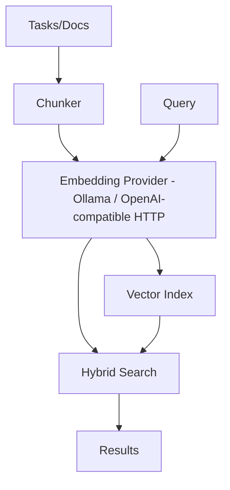
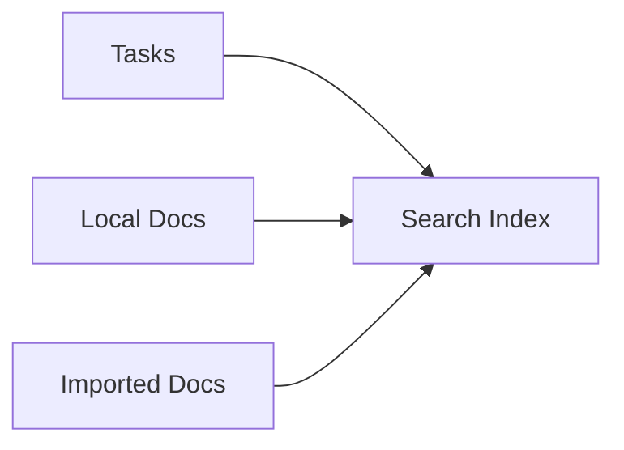

# Semantic Search Guide

Search tasks and docs by **meaning**, not just keywords. Embeddings are computed by [Ollama](https://ollama.com) (a local runtime) or any OpenAI-compatible embeddings API — no embedding model is bundled into the binary.

## Architecture



Keyword (BM25) search never depends on the embedding provider — it works the moment a project is initialized, with or without Ollama installed. When the embedder is unreachable or errors, semantic retrieval degrades to keyword results instead of failing the search.

## Quick Start

```bash
# Enable during init — init detects Ollama and offers a model, but never pulls one
knowns init my-project

# Or enable on an existing project
knowns config set semanticSearch.enabled true
knowns config set semanticSearch.provider ollama
knowns config set semanticSearch.model qwen3-embedding:0.6b
knowns search --reindex
```

## Choosing and Installing a Model

Installing Ollama, the recommended model table with tradeoffs, and the pull commands are not repeated here. They live in one place only:

- `docs/en/reference/ollama-embedding-models.md` (and the `vi` translation)

Setup, `doctor`, `init`, and this guide all point there instead of restating the advice, so it cannot drift between surfaces — read it before picking a model.

## Using a Third-Party Provider Instead

No `api` provider is seeded by default. To use a hosted OpenAI-compatible embeddings endpoint instead of Ollama:

```bash
knowns provider add --id openai --name "OpenAI" \
  --api-base https://api.openai.com/v1 --api-key sk-...
knowns config set semanticSearch.provider openai
knowns config set semanticSearch.model text-embedding-3-small
```

For why no `api` provider ships by default and for the exact `~/.knowns/settings.json` shape a hand-added model entry needs, see `docs/en/reference/ollama-embedding-models.md`.

## Search Usage

```bash
# Semantic search
knowns search "how to handle auth errors"

# Force keyword only
knowns search "auth error" --keyword

# Filter by type
knowns search "api design" --type doc
knowns search "login bug" --type task
```

## Configuration

In `.knowns/config.json`:

```json
{
  "settings": {
    "semanticSearch": {
      "enabled": true,
      "provider": "ollama",
      "model": "qwen3-embedding:0.6b"
    }
  }
}
```

## Indexing



Index auto-updates on create/update. Manual rebuild:
```bash
knowns search --reindex
```

## Troubleshooting

| Issue | Fix |
|-------|-----|
| Ollama not installed, not running, or model not pulled | `knowns doctor` names the exact next step for the state it detects; full guidance is in `docs/en/reference/ollama-embedding-models.md` |
| Index stale (e.g. after `knowns migrate`) | `knowns search --reindex` |
| Semantic search quietly returning keyword-only results | Expected when the embedder is unreachable — keyword search degrades gracefully instead of failing; check `knowns doctor` |

> Full reference: `docs/en/reference/ollama-embedding-models.md`
