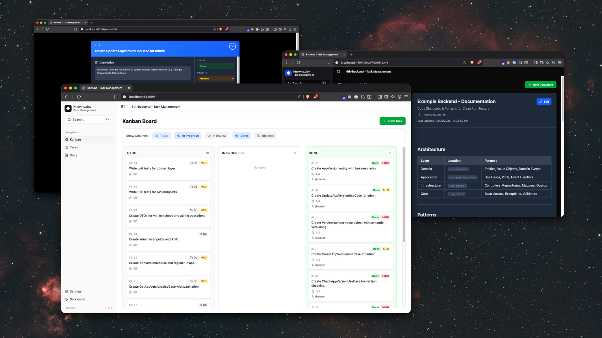

<p align="center">
  
</p>

<h1 align="center">Knowns</h1>

<p align="center">
  <strong>What your AI should have knowns.</strong>
</p>

<p align="center">
  CLI-first knowledge layer that gives AI persistent memory of your project.
</p>

<p align="center">
  <a href="https://www.npmjs.com/package/knowns"></a>
  <a href="https://www.npmjs.com/package/knowns"></a>
  <a href="https://github.com/knowns-dev/knowns/actions"></a>
  <a href="./LICENSE"></a>
  <br>
  <a href="#"></a>
  <a href="#"></a>
  <a href="#"></a>
  <a href="https://github.com/knowns-dev/knowns/stargazers"></a>
  <a href="#"></a>
</p>

---

> **TL;DR:** Knowns is a CLI-first knowledge layer that lets AI reliably read and reuse your project context — instead of asking the same questions every session.

## The Problem

AI assistants are stateless — they forget your architecture, patterns, and decisions every session.

```
Session 1: "Implement feature X" → AI: "How does your auth work?" → You explain

Session 2: "Implement feature Y" → AI: "How does your auth work?" → You explain AGAIN

Session 100: Still explaining the same thing...
```

## The Solution

```bash
# Document once
knowns doc create "Auth Pattern" -d "JWT with guards" -f patterns

# Reference everywhere
knowns task create "Add login" -d "Follow @doc/patterns/auth-pattern"

# AI reads context automatically — never forgets
```

**How it works:**

1. **You plan** — Create tasks with acceptance criteria in Web UI or CLI
2. **You link** — Reference docs like `@doc/patterns/auth` in task descriptions
3. **AI executes** — Tell AI _"Work on task 42"_, it reads the task, follows the refs, and implements

Knowns resolves `@doc/...` and `@task-...` into real files. AI reads them via [MCP](./docs/mcp-integration.md) or `--plain` output — no copy-paste needed.

## Install

```bash
# using npm
npm install -g knowns

# using bun
bun install -g knowns


knowns init
knowns browser  # Open Web UI
```

---

## Why Knowns over Notion / Jira / Obsidian?

|                     | Knowns                         | Notion/Jira         | Obsidian       |
| ------------------- | ------------------------------ | ------------------- | -------------- |
| **AI-readable**     | `--plain` output, MCP server   | Copy-paste manually | Plugins needed |
| **File-based**      | Git-friendly `.knowns/` folder | Cloud-locked        | Local files    |
| **CLI-first**       | Full CLI + Web UI              | Web only            | GUI only       |
| **Context linking** | `@doc/...` `@task-42` refs     | Manual links        | Wiki links     |
| **Source of truth** | Local files (Git-versioned)    | Remote database     | Local vault    |
| **Minimal setup**   | `knowns init` and done         | Complex setup       | Many plugins   |

**Best for:** Dev teams who pair with AI and want persistent project memory.

## Features

| Feature             | Description                                       |
| ------------------- | ------------------------------------------------- |
| **Task Management** | Create, track tasks with acceptance criteria      |
| **Documentation**   | Nested folders with markdown support              |
| **Time Tracking**   | Built-in timers and reports                       |
| **Context Linking** | `@task-42` and `@doc/patterns/auth` references    |
| **AI Integration**  | MCP Server, `--plain` output, guideline templates |
| **Web UI**          | Kanban board, doc browser, dark mode              |

---

## Quick Reference

```bash
# Tasks
knowns task create "Title" -d "Description" --ac "Criterion"
knowns task list --plain
knowns task <id> --plain                    # View task (shorthand)
knowns task edit <id> -s in-progress -a @me

# Documentation
knowns doc create "Title" -d "Description" -f "folder"
knowns doc "doc-name" --plain               # View doc (shorthand)
knowns doc "doc-name" --info --plain        # Check size/tokens first
knowns doc "doc-name" --toc --plain         # Get table of contents
knowns doc "doc-name" --section "2" --plain # Read specific section

# Time & Search
knowns time start <id> && knowns time stop
knowns search "query" --plain

# AI Guidelines
knowns agents guideline                     # Output guidelines to stdout
knowns agents sync                          # Sync CLAUDE.md, AGENTS.md (minimal)
knowns agents sync --full                   # Sync with full embedded guidelines
knowns agents sync --type mcp               # MCP tools format
```

---

## Documentation

| Guide                                          | Description                                |
| ---------------------------------------------- | ------------------------------------------ |
| [Command Reference](./docs/commands.md)        | All CLI commands with examples             |
| [Workflow Guide](./docs/workflow.md)           | Task lifecycle from creation to completion |
| [Reference System](./docs/reference-system.md) | How `@doc/` and `@task-` linking works     |
| [Web UI](./docs/web-ui.md)                     | Kanban board and document browser          |
| [MCP Integration](./docs/mcp-integration.md)   | Claude Desktop setup                       |
| [Configuration](./docs/configuration.md)       | Project structure and options              |
| [AI Workflow](./docs/ai-workflow.md)           | Guide for AI agents                        |
| [Developer Guide](./docs/developer-guide.md)   | Technical docs for contributors            |
| [Changelog](./CHANGELOG.md)                    | Version history                            |

---

## Roadmap

### Self-Hosted Team Sync 🚧 (Planned)

Knowns will optionally support a self-hosted sync server — for teams that want shared visibility without giving up local-first workflows.

- **Real-time visibility** — See who is working on what
- **Shared knowledge** — Sync tasks and documentation across the team
- **Progress tracking** — Track activity over time
- **Full data control** — Self-hosted, no cloud dependency

The CLI and local `.knowns/` folder remain the source of truth.
The server acts only as a sync and visibility layer.

---

## Development

```bash
npm install
npm run dev      # Dev mode
npm run build    # Build
npm run test     # Test
```

## Links

- [npm](https://www.npmjs.com/package/knowns)
- [GitHub](https://github.com/knowns-dev/knowns)
- [Changelog](./CHANGELOG.md)

For design principles and long-term direction, see [Philosophy](./PHILOSOPHY.md).

For technical details, see [Architecture](./ARCHITECTURE.md) and [Contributing](./CONTRIBUTING.md).

---

<p align="center">
  <strong>What your AI should have knowns.</strong><br>
  Built for dev teams who pair with AI.
</p>
