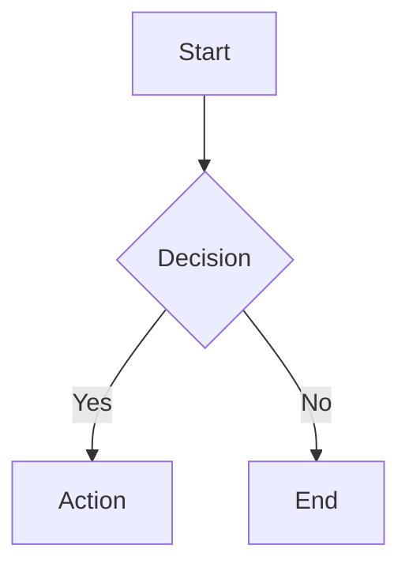

# Working with Documentation

**Announce:** "Using kn-doc to work with documentation."

**Core principle:** SEARCH BEFORE CREATING - avoid duplicates.

## Quick Reference

```json
// List docs
mcp__knowns__list_docs({})

// View doc (smart mode)
mcp__knowns__get_doc({ "path": "<path>", "smart": true })

// Search docs
mcp__knowns__search_docs({ "query": "<query>" })

// Create doc (MUST include description)
mcp__knowns__create_doc({
  "title": "<title>",
  "description": "<brief description of what this doc covers>",
  "tags": ["tag1", "tag2"],
  "folder": "folder"
})

// Update content
mcp__knowns__update_doc({
  "path": "<path>",
  "content": "content"
})

// Update metadata (title, description, tags)
mcp__knowns__update_doc({
  "path": "<path>",
  "title": "New Title",
  "description": "Updated description",
  "tags": ["new", "tags"]
})

// Update section only
mcp__knowns__update_doc({
  "path": "<path>",
  "section": "2",
  "content": "## 2. New Content\n\n..."
})
```

## Creating Documents

1. Search first (avoid duplicates)
2. Choose location:

| Type | Folder |
|------|--------|
| Core | (root) |
| Guide | `guides` |
| Pattern | `patterns` |
| API | `api` |

3. Create with **title + description + tags**
4. Add content
5. **Validate** after creating

**CRITICAL:** Always include `description` - validate will fail without it!

## Updating Documents

**Section edit is most efficient:**
```json
mcp__knowns__update_doc({
  "path": "<path>",
  "section": "3",
  "content": "## 3. New Content\n\n..."
})
```

## Validate After Changes

**CRITICAL:** After creating/updating docs, validate:

```json
mcp__knowns__validate({ "scope": "docs" })
```

If errors found, fix before continuing.

## Mermaid Diagrams

WebUI supports mermaid rendering. Use for:
- Architecture diagrams
- Flowcharts
- Sequence diagrams
- Entity relationships

````markdown

````

Diagrams render automatically in WebUI preview.

## Checklist

- [ ] Searched for existing docs
- [ ] Created with **description** (required!)
- [ ] Used section editing for updates
- [ ] Used mermaid for complex flows (optional)
- [ ] Referenced with `@doc/<path>`
- [ ] **Validated after changes**
