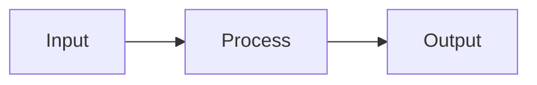

# Planning a Task

**Announce:** "Using kn-plan for task [ID]."

**Core principle:** GATHER CONTEXT → PLAN → VALIDATE → WAIT FOR APPROVAL.

## Mode Detection

Check if `$ARGUMENTS` contains `--from`:
- **Yes** → Go to "Generate Tasks from Spec" section
- **No** → Continue with normal planning flow

---

# Normal Planning Flow

## Step 1: Take Ownership

```json
mcp__knowns__get_task({ "taskId": "$ARGUMENTS" })
mcp__knowns__update_task({
  "taskId": "$ARGUMENTS",
  "status": "in-progress",
  "assignee": "@me"
})
mcp__knowns__start_time({ "taskId": "$ARGUMENTS" })
```

## Step 2: Gather Context

Follow refs in task:
```json
mcp__knowns__get_doc({ "path": "<path>", "smart": true })
mcp__knowns__get_task({ "taskId": "<id>" })
```

Search related:
```json
mcp__knowns__search_docs({ "query": "<keywords>" })
mcp__knowns__list_templates({})
```

## Step 3: Draft Plan

```markdown
## Implementation Plan
1. [Step] (see @doc/relevant-doc)
2. [Step] (use @template/xxx)
3. Add tests
4. Update docs
```

**Tip:** Use mermaid for complex flows:
````markdown

````

## Step 4: Save Plan

```json
mcp__knowns__update_task({
  "taskId": "$ARGUMENTS",
  "plan": "1. Step one\n2. Step two\n3. Tests"
})
```

## Step 5: Validate

**CRITICAL:** After saving plan with refs, validate to catch broken refs:

```bash
knowns validate --plain
```

If errors found (broken `@doc/...` or `@task-...`), fix before asking approval.

## Step 6: Ask Approval

Present plan and **WAIT for explicit approval**.

## Next Step

After approval: `/kn-implement $ARGUMENTS`

## Checklist

- [ ] Ownership taken
- [ ] Timer started
- [ ] Refs followed
- [ ] Templates checked
- [ ] **Validated (no broken refs)**
- [ ] User approved

---

# Generate Tasks from Spec

When `$ARGUMENTS` contains `--from @doc/specs/<name>`:

**Announce:** "Using kn-plan to generate tasks from spec [name]."

## Step 1: Read Spec Document

Extract spec path from arguments (e.g., `--from @doc/specs/user-auth` → `specs/user-auth`).

```json
mcp__knowns__get_doc({ "path": "specs/<name>", "smart": true })
```

## Step 2: Parse Requirements

Scan spec for:
- **Functional Requirements** (FR-1, FR-2, etc.)
- **Acceptance Criteria** (AC-1, AC-2, etc.)
- **Scenarios** (for edge cases)

Group related items into logical tasks.

## Step 3: Generate Task Preview

For each requirement/group, create task structure:

```markdown
## Generated Tasks from specs/<name>

### Task 1: [Requirement Title]
- **Description:** [From spec]
- **ACs:**
  - [ ] AC from spec
  - [ ] AC from spec
- **Spec:** specs/<name>
- **Priority:** medium

### Task 2: [Requirement Title]
- **Description:** [From spec]
- **ACs:**
  - [ ] AC from spec
- **Spec:** specs/<name>
- **Priority:** medium

---
Total: X tasks to create
```

## Step 4: Ask for Approval

> I've generated **X tasks** from the spec. Please review:
> - **Approve** to create all tasks
> - **Edit** to modify before creating
> - **Cancel** to abort

**WAIT for explicit approval.**

## Step 5: Create Tasks

When approved:

```json
mcp__knowns__create_task({
  "title": "<requirement title>",
  "description": "<from spec>",
  "spec": "specs/<name>",
  "priority": "medium",
  "labels": ["from-spec"]
})
```

Then add ACs:
```json
mcp__knowns__update_task({
  "taskId": "<new-id>",
  "addAc": ["AC 1", "AC 2", "AC 3"]
})
```

Repeat for each task.

## Step 6: Summary

```markdown
## Created Tasks

| ID | Title | ACs |
|----|-------|-----|
| task-xxx | Requirement 1 | 3 |
| task-yyy | Requirement 2 | 2 |

All tasks linked to spec: specs/<name>

Next steps:
- Start with: `/kn-plan <first-task-id>`
- Or view all: `knowns task list --spec specs/<name> --plain`
```

## Checklist (--from mode)

- [ ] Spec document read
- [ ] Requirements parsed
- [ ] Tasks previewed
- [ ] User approved
- [ ] Tasks created with spec link
- [ ] Summary shown
