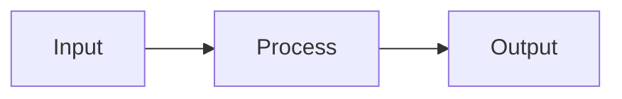

# Planning a Task

**Announce:** "Using kn:plan for task [ID]."

**Core principle:** GATHER CONTEXT → PLAN → VALIDATE → WAIT FOR APPROVAL.

## Step 1: Take Ownership

```json
mcp__knowns__get_task({ "taskId": "$ARGUMENTS" })
mcp__knowns__update_task({
  "taskId": "$ARGUMENTS",
  "status": "in-progress",
  "assignee": "@me"
})
mcp__knowns__start_time({ "taskId": "$ARGUMENTS" })
```

## Step 2: Gather Context

Follow refs in task:
```json
mcp__knowns__get_doc({ "path": "<path>", "smart": true })
mcp__knowns__get_task({ "taskId": "<id>" })
```

Search related:
```json
mcp__knowns__search_docs({ "query": "<keywords>" })
mcp__knowns__list_templates({})
```

## Step 3: Draft Plan

```markdown
## Implementation Plan
1. [Step] (see @doc/relevant-doc)
2. [Step] (use @template/xxx)
3. Add tests
4. Update docs
```

**Tip:** Use mermaid for complex flows:
````markdown

````

## Step 4: Save Plan

```json
mcp__knowns__update_task({
  "taskId": "$ARGUMENTS",
  "plan": "1. Step one\n2. Step two\n3. Tests"
})
```

## Step 5: Validate

**CRITICAL:** After saving plan with refs, validate to catch broken refs:

```json
mcp__knowns__validate({ "scope": "tasks" })
```

If errors found (broken `@doc/...` or `@task-...`), fix before asking approval.

## Step 6: Ask Approval

Present plan and **WAIT for explicit approval**.

## Next Step

After approval: `/kn:implement $ARGUMENTS`

## Checklist

- [ ] Ownership taken
- [ ] Timer started
- [ ] Refs followed
- [ ] Templates checked
- [ ] **Validated (no broken refs)**
- [ ] User approved
